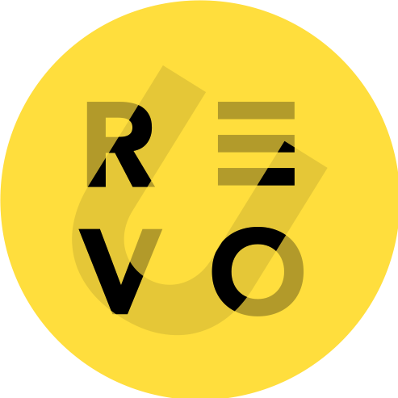

# 🌌 Galaxy Portfolio

Selamat datang di **Galaxy Portfolio**, sebuah website profil interaktif bertema galaksi yang dibangun menggunakan **Tailwind CSS**. Website ini dirancang untuk menampilkan informasi tentang *RevoU* dalam nuansa kosmik yang modern, responsif, dan menarik.

## 🚀 Fitur Utama

✨ **Desain Responsif**
Tampilan website menyesuaikan dengan baik di berbagai perangkat, dari desktop hingga smartphone.

🌗 **Mode Gelap/Terang (Dark/Light Mode)**
Pengguna dapat beralih tema dengan mudah sesuai kenyamanan mata.

📱 **Navigasi Mobile-Friendly**
Tersedia tombol menu untuk tampilan mobile agar navigasi tetap rapi dan mudah digunakan.

👋 **Salam Nama Dinamis**
Website menyapa pengguna dengan nama mereka melalui prompt yang interaktif.

🧑‍🚀 **Bagian Profil Informatif**
Menjelaskan tentang RevoU, visi, dan misi dengan gaya penyajian yang ramah dan mudah dipahami.

📬 **Formulir Pesan (Message Us)**
Pengguna dapat mengisi nama, email, dan pesan untuk menghubungi pemilik website.

## 🛠️ Teknologi yang Digunakan

* HTML5
* Tailwind CSS v2.2.19
* JavaScript DOM Manipulation
* Desain Web Responsif

## 🖼️ Pratinjau



## 💡 Cara Menggunakan

1. **Clone repository ini:**

```bash
git clone https://github.com/username/galaxy-portfolio.git
```

2. **Buka file `index.html` langsung melalui browser**
   Website ini bersifat statis dan tidak memerlukan backend maupun database.

## 🌐 Struktur Halaman

* `Home` – Sambutan awal untuk pengguna.
* `Our Profile` – Informasi lengkap mengenai RevoU.
* `Message Us` – Formulir untuk mengirim pesan.
* `Footer` – Bagian penutup dan hak cipta.

## 🧪 Catatan Developer

* Disarankan menambahkan `favicon` agar tampil lebih profesional.
* Bisa dikembangkan lebih lanjut dengan backend seperti Firebase atau Formspree untuk memproses pesan pengguna.
* Gambar dan isi teks bisa disesuaikan dengan kebutuhan masing-masing proyek.

## 📄 Lisensi

Lisensi MIT
Dibuat dengan 💛 oleh [annezetya](https://github.com/annezetya)
